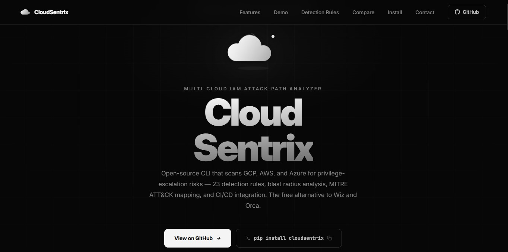

<div align="center">


<br/>

[](https://cloudsentrix.netlify.app/)
[](https://github.com/Talha-Imran-cloud/cloudsentrix/actions/workflows/ci.yml)
[](https://pypi.org/project/cloudsentrix/)
[](https://www.python.org/)
[](LICENSE)
[](tests/)

<p align="center">
  
</p>

<p align="center">
  <a href="https://cloudsentrix.netlify.app/">https://cloudsentrix.netlify.app/</a>
</p>

```
   _____ _                 _  _____            _      _      
  / ____| |               | |/ ____|          | |    (_)     
 | |    | | ___  _   _  __| | (___   ___ _ __ | |_ _ ___  __
 | |    | |/ _ \| | | |/ _` |\___ \ / _ \ '_ \| __| | \ \/ /
 | |____| | (_) | |_| | (_| |____) |  __/ | | | |_| |  >  < 
  \_____|_|\___/ \__,_|\__,_|_____/ \___|_| |_|\__|_|_/_/\_\
                                                    v2.0.0
```

**Multi-Cloud IAM Attack-Path Analyzer**

Open-source CLI that scans GCP, AWS, Azure, Kubernetes, and Terraform for privilege-escalation risks — 40 detection rules, blast radius analysis, MITRE ATT&CK mapping, cross-cloud attack chains, and CI/CD integration. **The free alternative to Wiz and Orca.**

[**🌐 Website**](https://cloudsentrix.netlify.app/) · [**📦 PyPI**](https://pypi.org/project/cloudsentrix/) · [**📖 Docs**](https://github.com/Talha-Imran-cloud/cloudsentrix#commands) · [**🐛 Issues**](https://github.com/Talha-Imran-cloud/cloudsentrix/issues)

</div>

---

## What It Does

| Target | Rules | Live Scan | Blast Radius | Dashboard | PDF |
|--------|-------|-----------|--------------|-----------|-----|
| ☁️ GCP IAM | 5 | ✅ gcloud | ✅ | ✅ | ✅ |
| 🟡 AWS IAM | 7 | ✅ boto3 + LocalStack | ✅ | ✅ | ✅ |
| 🔷 Azure RBAC | 5 | ✅ az CLI | ✅ | ✅ | ✅ |
| 🔷 Azure AD / Entra ID | 6 | ✅ az CLI | — | ✅ | ✅ |
| 🏗️ Terraform IaC + State | 11 | — | — | — | — |
| ☸️ Kubernetes RBAC | 6 | — | — | — | — |
| 🌐 Cross-Cloud Chains | — | — | — | — | ✅ JSON |
| **Total** | **40 rules** | | | | |

---

## Key Features

- **40 detection rules** — GCP, AWS, Azure RBAC, Azure AD, Terraform, K8s — all MITRE ATT&CK mapped
- **Industry-first cross-cloud attack chain detection** — AWS→Azure→GCP multi-hop paths
- **Blast radius** — GCP, AWS, Azure all supported
- **Terraform state file scanning** — detect leaked secrets in `.tfstate` files
- **Kubernetes RBAC scanning** — cluster-admin abuse, wildcard permissions, pod exec
- **Multi-cloud HTML dashboard** — animated, website-theme, all clouds side by side
- **Multi-cloud PDF report** — cover page, executive summary, per-cloud findings
- **Slack / Teams alerts** — send findings after every scan
- **CI/CD templates** — GitHub Actions, GitLab CI, Jenkins — ready to use
- **SARIF export** — upload directly to GitHub Security tab
- **Gemini AI summaries** — plain-language executive reports

---

## Installation

```bash
pip install cloudsentrix
```

**Kali Linux / Debian:**
```bash
pip install cloudsentrix --break-system-packages
```

**Virtual environment:**
```bash
python3 -m venv venv && source venv/bin/activate && pip install cloudsentrix
```

**Windows:**
```powershell
python -m venv venv
venv\Scripts\activate
pip install cloudsentrix
```

**From source:**
```bash
git clone https://github.com/Talha-Imran-cloud/cloudsentrix.git
cd cloudsentrix && pip install -e .
```

```bash
cloudsentrix --version
# CloudSentrix 2.0.0
```

---

## Quick Start

```bash
# GCP
cloudsentrix scan --file sample_data/sample_gcp_iam.json

# AWS
cloudsentrix scan --file sample_data/sample_aws_iam.json --cloud aws

# Azure
cloudsentrix scan --file sample_data/sample_azure_rbac.json --cloud azure

# Multi-cloud dashboard
cloudsentrix dashboard --gcp sample_data/sample_gcp_iam.json --aws sample_data/sample_aws_iam.json --azure sample_data/sample_azure_rbac.json --output dashboard.html

# Cross-cloud attack chains
cloudsentrix cross-cloud --aws sample_data/sample_aws_iam.json --azure sample_data/sample_azure_rbac.json

# Kubernetes RBAC
cloudsentrix k8s --path sample_data/sample_k8s_rbac.json

# Terraform scan
cloudsentrix terraform --path sample_data/sample_terraform/main.tf

# Terraform state secrets
cloudsentrix terraform --path sample_data/sample_terraform.tfstate
```

---

## Getting Your IAM Policy File

```bash
# GCP
gcloud projects get-iam-policy YOUR_PROJECT_ID --format=json > gcp_iam.json

# AWS
aws iam get-account-authorization-details --output json > aws_iam.json

# Azure RBAC
az role assignment list --all --output json > azure_rbac.json

# Azure AD / Entra ID
az ad app list --all --output json > azure_ad.json

# Kubernetes
kubectl get clusterroles,clusterrolebindings,roles,rolebindings -o json > k8s_rbac.json
```

---

## Commands

> **Windows:** Use single-line commands. Multi-line `\` syntax does not work in PowerShell.

### `scan` — Full pipeline scan
```bash
cloudsentrix scan --file sample_data/sample_gcp_iam.json
cloudsentrix scan --file sample_data/sample_aws_iam.json --cloud aws
cloudsentrix scan --file sample_data/sample_azure_rbac.json --cloud azure
cloudsentrix scan --file sample_data/sample_azure_ad.json --cloud azure-ad
cloudsentrix scan --file sample_data/sample_gcp_iam.json --severity critical
cloudsentrix scan --file sample_data/sample_gcp_iam.json --notify slack
```

### `cross-cloud` — Cross-Cloud Attack Chain Detection ⚡ Industry-First
```bash
cloudsentrix cross-cloud --aws sample_data/sample_aws_iam.json --azure sample_data/sample_azure_rbac.json
cloudsentrix cross-cloud --gcp sample_data/sample_gcp_iam.json --aws sample_data/sample_aws_iam.json --azure sample_data/sample_azure_rbac.json
cloudsentrix cross-cloud --aws sample_data/sample_aws_iam.json --azure sample_data/sample_azure_rbac.json --output chains.json
```

### `terraform` — Terraform IaC + State Scanning
```bash
# Scan .tf files
cloudsentrix terraform --path sample_data/sample_terraform/main.tf
cloudsentrix terraform --path /path/to/terraform/

# Scan .tfstate for leaked secrets
cloudsentrix terraform --path sample_data/sample_terraform.tfstate
cloudsentrix terraform --path terraform.tfstate --output secrets.json
```

### `k8s` — Kubernetes RBAC Scanning
```bash
cloudsentrix k8s --path sample_data/sample_k8s_rbac.json
cloudsentrix k8s --path /path/to/k8s/manifests/
cloudsentrix k8s --path k8s_rbac.json --output k8s_findings.json
```

### `dashboard` — Multi-Cloud HTML Dashboard
```bash
cloudsentrix dashboard --gcp sample_data/sample_gcp_iam.json --aws sample_data/sample_aws_iam.json --azure sample_data/sample_azure_rbac.json --output dashboard.html
cloudsentrix dashboard --gcp sample_data/sample_gcp_iam.json --aws sample_data/sample_aws_iam.json --output dashboard.html
```

### `report-multi` — Multi-Cloud PDF Report
```bash
cloudsentrix report-multi --gcp sample_data/sample_gcp_iam.json --aws sample_data/sample_aws_iam.json --azure sample_data/sample_azure_rbac.json --output multi_cloud_report.pdf
```

### `report` — Single-Cloud PDF
```bash
cloudsentrix report --file sample_data/sample_gcp_iam.json --output report.pdf --no-ai
cloudsentrix report --file sample_data/sample_aws_iam.json --cloud aws --output aws_report.pdf --no-ai
cloudsentrix report --file sample_data/sample_azure_rbac.json --cloud azure --output azure_report.pdf --no-ai
```

### `live-scan` — Scan Live Cloud Account
```bash
# GCP
cloudsentrix live-scan --project my-gcp-project-id

# AWS (requires: pip install boto3)
cloudsentrix live-scan --cloud aws
cloudsentrix live-scan --cloud aws --profile my-profile --region us-west-2
cloudsentrix live-scan --cloud aws --endpoint http://localhost:4566

# Azure
cloudsentrix live-scan --cloud azure --subscription my-subscription-id
```

### `export` — Export Results
```bash
cloudsentrix export --file sample_data/sample_gcp_iam.json --output dashboard.html
cloudsentrix export --file sample_data/sample_aws_iam.json --cloud aws --output report.json
cloudsentrix export --file sample_data/sample_gcp_iam.json --output report.csv
cloudsentrix export --file sample_data/sample_gcp_iam.json --output results.sarif
```

### `score` — Security Score
```bash
cloudsentrix score --file sample_data/sample_gcp_iam.json
cloudsentrix score --file sample_data/sample_aws_iam.json --cloud aws --json
cloudsentrix score --file sample_data/sample_gcp_iam.json --min-score 70
```

### `validate` — Validate File Format
```bash
cloudsentrix validate --file sample_data/sample_gcp_iam.json
cloudsentrix validate --file sample_data/sample_aws_iam.json --cloud aws
cloudsentrix validate --file sample_data/sample_azure_rbac.json --cloud azure
cloudsentrix validate --file sample_data/sample_azure_ad.json --cloud azure-ad
```

### Other Commands
```bash
cloudsentrix blast-radius --file sample_data/sample_gcp_iam.json --principal admin@company.com
cloudsentrix principal-path --file sample_data/sample_gcp_iam.json --source intern@company.com --target sa@my-project.iam.gserviceaccount.com
cloudsentrix mitre-map --file sample_data/sample_gcp_iam.json
cloudsentrix remediate --file sample_data/sample_gcp_iam.json --severity critical
cloudsentrix compare --old january.json --new february.json
cloudsentrix watch --path sample_data/sample_gcp_iam.json
cloudsentrix list-principals --file sample_data/sample_aws_iam.json --cloud aws
cloudsentrix rules
```

---

## Slack / Teams Alerts

```bash
# Slack
export CLOUDSENTRIX_SLACK_WEBHOOK="https://hooks.slack.com/services/YOUR/WEBHOOK"
cloudsentrix scan --file sample_data/sample_gcp_iam.json --notify slack

# Teams
export CLOUDSENTRIX_TEAMS_WEBHOOK="https://your-org.webhook.office.com/..."
cloudsentrix scan --file sample_data/sample_gcp_iam.json --notify teams

# Direct URL
cloudsentrix scan --file sample_data/sample_gcp_iam.json --notify slack --webhook https://hooks.slack.com/services/YOUR/WEBHOOK
```

---

## CI/CD Integration

Ready-made templates in `ci-templates/` folder.

### GitHub Actions
```yaml
- name: Install CloudSentrix
  run: pip install cloudsentrix

- name: Scan GCP IAM
  run: cloudsentrix scan --file gcp_iam.json --severity high

- name: Generate SARIF
  run: cloudsentrix export --file gcp_iam.json --output results.sarif

- name: Upload to GitHub Security
  uses: github/codeql-action/upload-sarif@v3
  with:
    sarif_file: results.sarif
```

### GitLab CI
```yaml
cloudsentrix-scan:
  image: python:3.11
  script:
    - pip install cloudsentrix
    - cloudsentrix scan --file gcp_iam.json --cloud gcp
  allow_failure: false
```

### Jenkins
```groovy
stage('Security Scan') {
    steps {
        sh 'pip install cloudsentrix'
        sh 'cloudsentrix scan --file gcp_iam.json --cloud gcp'
    }
}
```

---

## AWS LocalStack Testing

```bash
pip install localstack awscli-local
localstack start
awslocal iam create-user --user-name test-admin
awslocal iam attach-user-policy --user-name test-admin --policy-arn arn:aws:iam::aws:policy/AdministratorAccess
cloudsentrix live-scan --cloud aws --endpoint http://localhost:4566
```

---

## Gemini AI Summary

```bash
export GEMINI_API_KEY="your_api_key_here"
cloudsentrix report --file sample_data/sample_gcp_iam.json --output report.pdf
```

Get free API key from [Google AI Studio](https://aistudio.google.com/app/apikey)

---

## Exit Codes

| Code | Meaning |
|------|---------|
| `0` | No CRITICAL findings |
| `1` | CRITICAL findings — fail the pipeline |
| `2` | Command error |

---

## Detection Rules

### ☁️ GCP (5 rules)
| Rule | Title | Severity | MITRE |
|------|-------|----------|-------|
| GCP-001 | Publicly Accessible Role Binding | CRITICAL | T1078.004 |
| GCP-002 | Service Account Token Creator | CRITICAL | T1098.001 |
| GCP-003 | Service Account Key Admin | CRITICAL | T1098.001 |
| GCP-004 | IAM Policy Administrator | CRITICAL | T1098.003 |
| GCP-005 | Service Account Impersonation via Resource Attach | HIGH | T1548.005 |

### 🟡 AWS (7 rules)
| Rule | Title | Severity | MITRE |
|------|-------|----------|-------|
| AWS-001 | Administrator Access — Full AWS Control | CRITICAL | T1078.004 |
| AWS-002 | IAM PassRole — Privilege Escalation via Service | CRITICAL | T1098.003 |
| AWS-003 | IAM Policy Manipulation — Self-Escalation Path | CRITICAL | T1098.003 |
| AWS-004 | Publicly Assumable Role — Trust Policy Allows Anyone | CRITICAL | T1078.004 |
| AWS-005 | Access Key Creation — Long-Lived Credential Backdoor | CRITICAL | T1098.001 |
| AWS-006 | Backdoor IAM User Creation | CRITICAL | T1136.003 |
| AWS-007 | IAMFullAccess — Complete IAM Control | CRITICAL | T1098.003 |

### 🔷 Azure RBAC (5 rules)
| Rule | Title | Severity | MITRE |
|------|-------|----------|-------|
| AZ-001 | Owner / Contributor at Broad Scope | CRITICAL | T1078.004 |
| AZ-002 | Service Principal with High-Privilege Role | CRITICAL | T1098.001 |
| AZ-003 | Guest User with Elevated Role | HIGH | T1078.006 |
| AZ-004 | Over-permissive Role Scope | HIGH | T1548.005 |
| AZ-005 | Custom Role with Dangerous Permissions | HIGH | T1098.003 |

### 🔷 Azure AD / Entra ID (6 rules)
| Rule | Title | Severity | MITRE |
|------|-------|----------|-------|
| AZAD-001 | Dangerous OAuth Permission | CRITICAL | T1528 |
| AZAD-002 | Orphaned App Registration | HIGH | T1098.001 |
| AZAD-003 | Multi-Tenant App with Broad Permissions | CRITICAL | T1199 |
| AZAD-004 | Expired App Credentials | MEDIUM | T1552.001 |
| AZAD-005 | App Credential With No Expiry | HIGH | T1528 |
| AZAD-006 | Service Principal with High-Privilege App Roles | CRITICAL | T1098.003 |

### 🏗️ Terraform IaC (10 rules) + State (1 rule)
| Rule | Title | Severity | MITRE |
|------|-------|----------|-------|
| TF-001 | AWS IAM Wildcard Policy (Action:* Resource:*) | CRITICAL | T1078.004 |
| TF-002 | AWS IAM Role Public Trust Policy (Principal:*) | CRITICAL | T1078.004 |
| TF-003 | AWS AdministratorAccess Policy Attached | CRITICAL | T1078.004 |
| TF-004 | GCP Public IAM Binding (allUsers) | CRITICAL | T1078.004 |
| TF-005 | GCP Owner/Editor Role Binding | HIGH | T1098.003 |
| TF-006 | Azure Owner Role Assignment | CRITICAL | T1078.004 |
| TF-007 | Hardcoded Secrets / Access Keys | CRITICAL | T1552.001 |
| TF-008 | AWS IAM Policy Uses NotAction | HIGH | T1078.004 |
| TF-009 | AWS IAM Inline Policy on User | MEDIUM | T1078.004 |
| TF-010 | Sensitive Policy Missing MFA Condition | MEDIUM | T1078.004 |
| TFS-001 | Secret Leaked in Terraform State File | CRITICAL | T1552.001 |

### ☸️ Kubernetes RBAC (6 rules)
| Rule | Title | Severity | MITRE |
|------|-------|----------|-------|
| K8S-001 | ClusterRoleBinding to cluster-admin | CRITICAL | T1078.001 |
| K8S-002 | Wildcard Permissions in Role | CRITICAL | T1078.001 |
| K8S-003 | Role Can Read Kubernetes Secrets | HIGH | T1552.007 |
| K8S-004 | Default ServiceAccount Bound to Privileged Role | HIGH | T1078.001 |
| K8S-005 | Anonymous / Unauthenticated Access Granted | CRITICAL | T1078.001 |
| K8S-006 | Role Allows Pod Exec/Attach | HIGH | T1609 |

---

## Project Structure

```
cloudsentrix/
├── src/
│   ├── cli.py                    # CLI entry point (19 commands)
│   ├── parser.py                 # GCP IAM parser
│   ├── graph.py                  # GCP graph engine
│   ├── detection.py              # GCP detection (5 rules)
│   ├── risk_score.py             # 0-100 scoring engine
│   ├── blast_radius.py           # GCP blast radius
│   ├── watch_handler.py          # File watcher
│   ├── live_scanner.py           # Live GCP scanner
│   ├── pdf_report.py             # Single-cloud PDF
│   ├── ai_summary.py             # Gemini AI integration
│   ├── aws_parser.py             # AWS IAM parser
│   ├── aws_graph.py              # AWS graph engine
│   ├── aws_detection.py          # AWS detection (7 rules)
│   ├── aws_blast_radius.py       # AWS blast radius
│   ├── aws_live_scanner.py       # Live AWS scanner
│   ├── azure_parser.py           # Azure RBAC parser
│   ├── azure_detection.py        # Azure RBAC detection (5 rules)
│   ├── azure_risk_score.py       # Azure scoring engine
│   ├── azure_blast_radius.py     # Azure blast radius
│   ├── azure_exporter.py         # Azure JSON/CSV/SARIF/HTML
│   ├── azure_live_scanner.py     # Live Azure scanner
│   ├── azure_ad_parser.py        # Azure AD parser
│   ├── azure_ad_detection.py     # Azure AD detection (6 rules)
│   ├── terraform_scanner.py      # Terraform IaC + State scanner (11 rules)
│   ├── k8s_scanner.py            # Kubernetes RBAC scanner (6 rules)
│   ├── cross_cloud_detector.py   # Cross-cloud attack chain detection
│   ├── multi_dashboard.py        # Multi-cloud animated HTML dashboard
│   ├── multi_pdf_report.py       # Multi-cloud PDF report
│   └── notifier.py               # Slack / Teams webhook alerts
├── ci-templates/
│   ├── github-actions-gcp.yml
│   ├── github-actions-aws.yml
│   ├── github-actions-multi-cloud.yml
│   ├── gitlab-ci.yml
│   └── jenkins-pipeline.groovy
├── tests/                        # 144 pytest tests
├── sample_data/
│   ├── sample_gcp_iam.json
│   ├── demo_enterprise_iam.json
│   ├── sample_aws_iam.json
│   ├── sample_azure_rbac.json
│   ├── sample_azure_ad.json
│   ├── sample_k8s_rbac.json
│   ├── sample_terraform.tfstate
│   └── sample_terraform/
│       └── main.tf
├── .github/workflows/ci.yml
├── .github/workflows/publish.yml
├── pyproject.toml
└── README.md
```

---

## Roadmap

| Feature | Status |
|---------|--------|
| GCP IAM — 5 rules, blast radius, remediation, live scan | ✅ Shipped |
| AWS IAM — 7 rules, blast radius, PassRole, live scan, LocalStack | ✅ Shipped |
| Azure RBAC — 5 rules, blast radius, live scan | ✅ Shipped |
| Azure AD / Entra ID — 6 rules, OAuth risks, orphaned apps | ✅ Shipped |
| Terraform IaC Scanner — 10 rules, GCP+AWS+Azure | ✅ Shipped |
| Terraform State Scanner — leaked secrets in .tfstate | ✅ Shipped |
| Kubernetes RBAC Scanner — 6 rules | ✅ Shipped |
| Cross-Cloud Attack Chain Detection — industry-first | ✅ Shipped |
| Multi-Cloud Animated HTML Dashboard | ✅ Shipped |
| Multi-Cloud PDF Report | ✅ Shipped |
| Slack / Teams Webhook Alerts | ✅ Shipped |
| CI/CD Templates — GitHub Actions, GitLab, Jenkins | ✅ Shipped |
| Gemini AI Executive Summaries | ✅ Shipped |
| Local Web Dashboard (Flask serve command) | 🔄 Planned |

---

## Running Tests

```bash
pip install -e ".[dev]"
pytest tests/ -v
```

Expected: `144 passed`

---

## License

MIT — free to use, modify, and distribute.

---

<div align="center">

## Author

**Talha Imran** — SOC Analyst | Cloud Security | Pentesting

[](https://cloudsentrix.netlify.app/)
[](https://github.com/Talha-Imran-cloud)
[](https://www.linkedin.com/in/talha-imran-583a44420)
[](https://pypi.org/project/cloudsentrix/)

</div>
